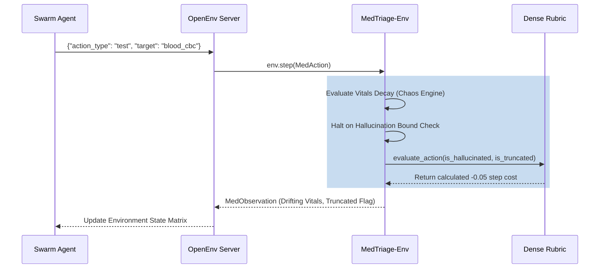

# MedTriage-Env 


A rigorous, professional-grade medical diagnostic simulator natively conforming to the **Meta PyTorch OpenEnv Hackathon** architecture. Designed specifically to host **Multi-Agent Scientists** and Reinforcement Learning (PPO/GRPO) algorithms on highly complex sequential diagnostic pathways.

---

## Extreme Edge Competitive Features

### 1. The Procedural Data Engine (Infinite Environment Horizons)
The biggest bottleneck in reinforcement learning is data overfitting to static patient JSONs. `MedTriage-Env` radically solves this. If an agent initializes the environment with `difficulty="infinite"`, the native procedural generation engine activates. It physically mutates baseline schemas, hallucinates new timestamp presentations, and skews baseline vitals dynamically. This constructs an **Infinite RL Horizon**—agents can train endlessly on synthetic data without ever seeing the exact same patient twice.

### 2. Live Clinical Audit & Medical Discharges
When an episode explicitly terminates (via successful surgical mapping or algorithmically crashing the patient via extreme time delays), the environment natively mints a `Discharge_Report.md` directly into a `/reports` disk folder. This markdown document mathematically audits the entire trajectory, specifying *Critical Tests Missed*, net diagnostic rewards, and total procedural costs incurred. 

### 3. Multi-Agent Collaborative Native Support 
Taking queues from bleeding-edge OpenAI Swarm models and OpenEnv protocols, `MedTriage-Env` ships natively with collaborative agent benchmarking. We've included `multi_agent_triage.py`, a zero-shot bridge that deploys an **Examining Doctor Agent** and an **Attending Consultant Agent** into the environment simultaneously. They evaluate vitals, negotiate on clinical tests via chained reasoning, and natively submit JSON parameters to cure the patient as a unit.

### 2. Trajectory Mastery Scoring (Meta RFC-004 Compliant) 
We explicitly reverse-engineered **RFC-004: Delayed Rewards** from the PyTorch active open-source roadmap. If your agent (or multi-agent bot) diagnoses and treats a patient accurately in under 30 simulated minutes (relying heavily on strategic `INTERVIEW` queries rather than lazy 45-minute MRI loops), the `MedDenseRubric` computes end-of-episode trajectory global mastery, awarding a massive `+3.0` Delayed Bonus. 

### 3. The Clinical Chaos Engine (Vitals Drift) 
A massive departure from standard "static text games". If an RL agent wastes time running redundant tests, the internal simulated clock advances. If `time_elapsed` creeps too high and the patient's organic mathematical health algorithm decays below 70%, the Patient's **Vitals begin to physically warp**. 
* e.g., `HR` deterministically spikes from `120` to `155 (Drifting upward due to treatment delay)`. Agents must infer physical changes mathematically in real-time, bridging traditional RL paradigms with real medical constraint vectors.

### 4. Strict Anti-Hallucination Guardrails 
Models hallucinate. `MedTriage-Env` acts as a hard boundary checker. If an RL agent predicts an `EXAMINE`, `INTERVIEW`, or `TEST` target that does not map to the dynamic subset of `available_actions` provided per individual patient, the environment forcibly rejects it via `is_hallucinated=True`, applying a rigorous `-1.0` penalty to train LLMs heavily away from clinical hallucinations. 

### 5. Dynamic Patient Crashing (Truncation Limiter) 
A doctor doesn't have infinite time.
If an agent wastes 180 simulated minutes (3 hours of ordering scans), the patient algorithmically *crashes*. This natively triggers `truncated=True` returning a `-5.0` penalty to the RL trainer to ensure risk-management protocols are weighted highly. When the episode truncates or completes, it natively spits out a `--- CLINICAL AUDIT REPORT ---` tallying critical tests missed.

---

## Architecture Matrix



---

## Quickstarts & Deployments

We provide 3 exact ways to spin up the architecture based on your pipeline complexity desires.

### 1. Developer Setup
```bash
git clone https://github.com/Darsh505/Med-Triage.git
cd Med-Triage
python3 -m venv venv
source venv/bin/activate
make install
```

### 2. The Multi-Agent Swarm (Zero-Shot) 
To watch the *Examining Doctor* and the *Attending Consultant* attempt to solve the environment sequence natively using chained reasoning:
```bash
export OPENAI_API_KEY="sk-..."
python examples/multi_agent_triage.py
```

### 3. Beautiful Web GUI Sandbox 
Prefer browser interaction? We've bundled a fully reactive Gradio Chat interface so judges and researchers can literally play your environment seamlessly inside a browser tab!
```bash
pip install gradio
python examples/gradio_app.py
```

### 4. Interactive RL Simulation UI 
Instead of waiting to train an LLM locally, **play the interactive role of the RL Neural Network yourself!** We built an insanely fast, beautiful terminal-native UI to experience precisely the constraints, reward matrices, and drifting outputs that your algorithms see.
```bash
make play
```

---
*Created definitively for the Meta PyTorch OpenEnv Hackathon.*
