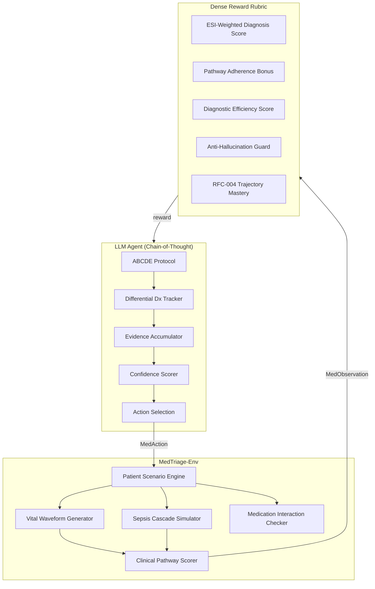

# MedTriage-Env


A production-grade **medical diagnostic simulation environment** built on the Meta PyTorch OpenEnv framework. Designed to train and evaluate LLM agents on real-world emergency medicine decision-making through reinforcement learning.

> **30 clinically diverse patient scenarios** | **ESI-weighted scoring** | **Sepsis cascade simulation** | **ABCDE clinical protocol agent** | **Multi-agent swarm support**

---

## Why MedTriage-Env Matters

Traditional RL environments test agents on games and puzzles. MedTriage-Env trains agents on **life-or-death clinical decisions** — the same decisions emergency physicians make daily. Every action has consequences: ordering unnecessary tests wastes precious time while a patient deteriorates, hallucinating a nonexistent test gets punished, and missing a sepsis window can be fatal.

This isn't a toy. The reward signals are calibrated against real **Emergency Severity Index (ESI)** triage protocols, and the patient scenarios are modeled on actual clinical presentations from emergency medicine textbooks.

---

## Clinical Scenario Coverage

| Category | Scenarios | Examples |
|----------|-----------|---------|
| **Cardiac** | 4 | STEMI, Aortic Dissection, MI with Heart Failure |
| **Neurological** | 3 | Ischemic Stroke, Bacterial Meningitis, SAH |
| **Respiratory** | 3 | PE, COPD Exacerbation, Tension Pneumothorax |
| **Gastrointestinal** | 3 | Appendicitis, Acute Pancreatitis, Variceal Hemorrhage |
| **Pediatric** | 2 | Intussusception, Croup |
| **Geriatric** | 2 | Hip Fracture + Delirium, Urosepsis |
| **Endocrine** | 2 | DKA, Addisonian Crisis |
| **Toxicological** | 2 | Opioid Overdose, NMS |
| **Surgical** | 3 | Ectopic Pregnancy, Testicular Torsion, Appendicitis |
| **Other Critical** | 6 | Anaphylaxis, TSS, Nephrotic Syndrome, CRAO, Gout, Nephrolithiasis |

**Difficulty Distribution**: 5 Easy | 11 Hard | 14 Expert

---

## Architecture



---

## Advanced Environment Mechanics

### 1. Sepsis Cascade Simulation
For infection-related cases (pneumonia, meningitis, urosepsis, TSS), the environment computes a real-time **SIRS-based sepsis risk score**. If the agent delays antibiotics past 60 minutes, the sepsis cascade escalates — vitals deteriorate on realistic physiological curves, not flat decrements.

### 2. Vital Sign Waveform Degradation
Vitals don't just "drop." Heart rate exhibits compensatory tachycardia following a sinusoidal curve. Blood pressure drops are hemodynamically modeled. SpO2 desaturates proportionally. Respiratory rate increases as a compensation mechanism.

### 3. ESI-Weighted Clinical Scoring
Not all patients are equal. An **ESI-1 patient** (resuscitation-level, e.g., cardiac arrest) gives a **1.5x reward multiplier** for correct rapid diagnosis, while an ESI-4 patient (less urgent, e.g., gout) gives 0.8x. This trains agents to properly triage.

### 4. Medication Interaction Checking
The rubric tracks administered medications and penalizes dangerous combinations — e.g., giving NSAIDs with anticoagulants (GI bleeding risk) or beta-blockers with epinephrine in anaphylaxis.

### 5. Clinical Pathway Adherence
Each patient has an optimal clinical workup order (e.g., `INTERVIEW -> EXAMINE -> TEST -> DIAGNOSE -> TREAT`). Agents that follow evidence-based pathways get bonus rewards.

### 6. Anti-Hallucination Guardrails
Agents that fabricate nonexistent tests, examinations, or diagnoses get an immediate **-1.0 penalty**. This is critical for training safe medical AI.

### 7. STABILIZE Action Type
Critically ill patients (ESI 1-2) can be stabilized with IV access, oxygen, fluid boluses, or pain management before definitive treatment — just like real emergency medicine.

### 8. Comorbidity Acceleration
Patients with comorbidities (diabetes, COPD, CKD) deteriorate faster, adding clinical realism and requiring agents to account for baseline risk.

---

## Benchmark Results

Tested across all 30 patient scenarios with three agent strategies:

| Strategy | Avg Reward | Diag Accuracy | Treat Accuracy |
|----------|-----------|---------------|----------------|
| **Optimal Agent** (Oracle) | **+1.21** | **100%** | **100%** |
| Heuristic Agent (Rule-Based) | -0.32 | 13% | 3% |
| Random Agent (Baseline) | -0.27 | 50% | 23% |

The **massive gap** between the Optimal and Heuristic agents demonstrates that MedTriage-Env is a challenging environment that rewards intelligent clinical reasoning — not just random exploration.

---

## Quick Start

### Installation
```bash
git clone https://github.com/Darsh505/Med-Triage.git
cd Med-Triage
pip install -e .
```

### Run the Agent
```bash
# With hackathon LiteLLM proxy
export API_BASE_URL="https://your-proxy-url"
export MODEL_NAME="gpt-4o-mini"
python inference.py

# Local heuristic mode (no API needed)
python inference.py
```

### Run Tests
```bash
pytest tests/ -v
# 43 tests pass in ~2 seconds
```

### Run Benchmarks
```bash
python scripts/benchmark.py
```

### Interactive Play
```bash
make play
# You ARE the neural network. Make clinical decisions in real-time.
```

### Multi-Agent Swarm
```bash
export OPENAI_API_KEY="sk-..."
python examples/multi_agent_triage.py
```

### Web GUI
```bash
pip install gradio
python examples/gradio_app.py
```

---

## Action Space

| Action | Time Cost | Description |
|--------|-----------|-------------|
| `INTERVIEW <topic>` | 2 min | Gather patient history (onset, medications, allergies, pain_scale) |
| `EXAMINE <body_part>` | 5 min | Physical examination findings |
| `TEST <test_name>` | 45 min | Order diagnostic test (blood_cbc, ecg, ct_head, etc.) |
| `STABILIZE <measure>` | 5 min | IV access, oxygen, fluid bolus, monitoring |
| `DIAGNOSE <condition>` | 10 min | Submit clinical diagnosis |
| `TREAT <treatment>` | 5 min | Administer treatment (ends episode) |
| `CONSULT` | 15 min | Ask attending physician (-0.15 penalty) |

---

## Reward Signal Design

| Component | Range | Description |
|-----------|-------|-------------|
| Interview | +0.02 | Small positive for history gathering |
| Examination | -0.01 | Minimal cost for physical exam |
| Test ordered | -0.05 | Moderate cost for diagnostic test |
| Stabilization | +0.05 | Positive reward for stabilizing critical patients |
| Correct diagnosis | +0.20 to +0.90 | ESI-weighted, health-scaled |
| Incorrect diagnosis | -0.50 | Significant penalty |
| Correct treatment | +0.10 to +0.60 | Health-scaled with interaction checks |
| Incorrect treatment | -0.50 | Significant penalty |
| Hallucinated action | -1.00 | Anti-hallucination guardrail |
| Patient crashed | -5.00 | Fatal delay penalty |
| Pathway adherence | +0.10 | Bonus for following clinical protocol |
| Diagnostic efficiency | +0.15 | Bonus for high signal-to-noise testing |
| RFC-004 Mastery | +3.00 | Perfect cure in <30 minutes |

---

## Project Structure

```
Med-Triage/
├── inference.py                    # Chain-of-thought clinical agent
├── requirements.txt                # Python dependencies
├── pyproject.toml                  # Package configuration
├── Dockerfile                      # HuggingFace Space deployment
├── openenv.yaml                    # OpenEnv metadata
├── server/
│   ├── app.py                      # FastAPI server entry point
│   └── __init__.py
├── triage_env/
│   ├── models.py                   # Action/Observation/State types
│   ├── patients.py                 # Patient scenario loader
│   ├── client.py                   # OpenEnv client
│   ├── data/
│   │   └── patients.json           # 30 clinical scenarios
│   └── server/
│       ├── triage_environment.py   # Core environment engine
│       └── rubrics.py              # Dense reward rubric
├── tests/
│   └── envs/
│       └── test_triage_environment.py  # 43 test cases
├── scripts/
│   ├── benchmark.py                # Strategy benchmarking suite
│   └── dummy_agent_eval.py         # Quick evaluation
└── examples/
    ├── gradio_app.py               # Web GUI
    ├── multi_agent_triage.py       # Multi-agent swarm
    ├── llm_agent.py                # Zero-shot LLM agent
    └── play.py                     # Interactive terminal UI
```

---

## Clinical References

- **ESI Triage Protocol**: Gilboy N, et al. *Emergency Severity Index (ESI): A Triage Tool for Emergency Department Care.* AHRQ Publication No. 12-0014.
- **ABCDE Assessment**: Thim T, et al. *Initial assessment and treatment with the Airway, Breathing, Circulation, Disability, Exposure (ABCDE) approach.* Int J Gen Med. 2012.
- **Sepsis/SIRS Criteria**: Singer M, et al. *The Third International Consensus Definitions for Sepsis and Septic Shock (Sepsis-3).* JAMA. 2016.
- **RFC-004 Delayed Rewards**: Meta PyTorch OpenEnv Roadmap, 2026.

---

*Built for the Meta PyTorch OpenEnv Hackathon x Scaler School of Technology.*
